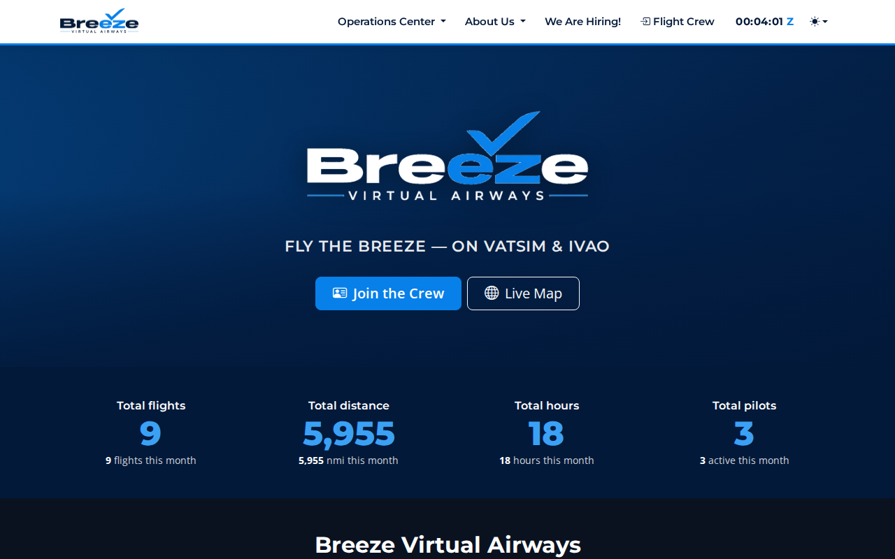
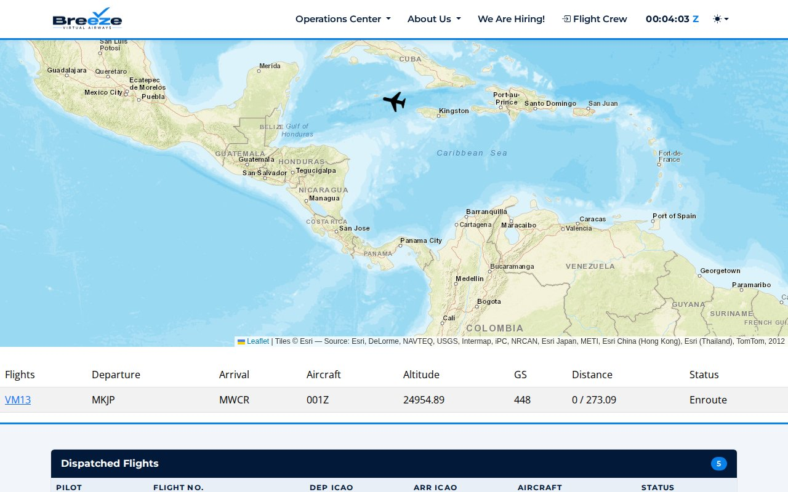
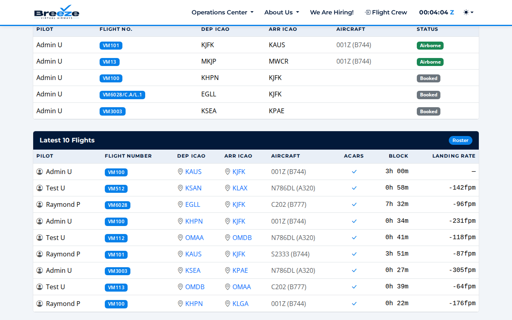
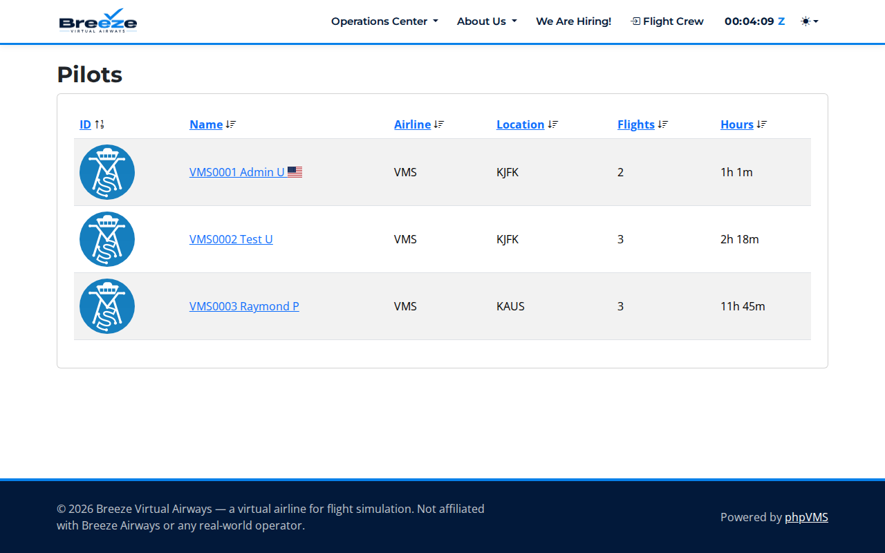
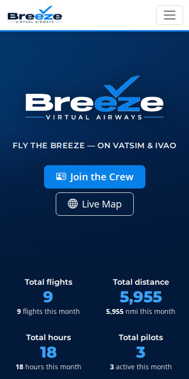

# Breeze Virtual Airways — phpVMS skin

A custom phpVMS 7 skin for **breezevirtualairways.org**, laid out to match the structure of
[frontierva.org](https://frontierva.org): white sticky header with a grouped dropdown nav and a
live Zulu clock, full-bleed hero, brand-coloured stats band, welcome block, full-width live map,
then the Dispatched Flights and Latest 10 Flights panels.

Colours come straight off the supplied logo — navy `#02193a` and light blue `#0780e9`.

## Screenshots

| | |
|---|---|
|  |  |
| Hero + stats band | Live map, wired to phpVMS's own ACARS feed |
|  |  |
| Dispatched Flights + Latest 10 Flights | The stock roster page, inheriting the skin |



## What's in here

```
theme/breeze/
├── theme.json        # declares the skin; extends "seven"
├── app.blade.php     # page shell, brand variables, all skin CSS, Zulu clock script
├── nav.blade.php     # white header, dropdown nav, clock, light/dark switch
└── home.blade.php    # hero, stats band, welcome, live map, dispatch + latest flights
assets/
├── logo.png          # supplied logo, white background knocked out to transparent
└── logo-light.png    # same logo with the navy wordmark recoloured white, for dark backgrounds
```

`theme.json` sets `"extends": "seven"`, so every page this skin doesn't override — roster,
schedules, dispatch, PIREPs, profiles, downloads, the whole admin area — falls through to the
stock theme and picks up the branding from the CSS variables. **No phpVMS core file is touched**,
so phpVMS updates can be applied normally.

## The numbers are real

Nothing on the home page is hard-coded. Every figure is a live query against the install:

- **Total flights / distance / hours** — summed from filed PIREPs, excluding drafts,
  cancelled, rejected and deleted.
- **…this month** — the same sums filtered from the first of the current month, computed
  from `now()`, so they roll over on their own.
- **Total pilots / active this month** — users, and distinct users who filed this month.
- **Dispatched Flights** — anything currently airborne (PIREP state `IN_PROGRESS`) plus open bids.
- **Latest 10 Flights** — the ten most recent filed PIREPs, with a tick when the report came
  from ACARS rather than being filed by hand, plus the recorded landing rate.

## Installing

```bash
cp -r theme/breeze   /path/to/phpvms/resources/views/layouts/
cp -r assets/.       /path/to/phpvms/public/assets/breeze/

php artisan theme:refresh-cache     # phpVMS caches the theme list; this is required
php artisan view:clear
```

Then pick **breeze** in Admin → Settings → Theme.

## Notes

- Built and verified against phpVMS 7 (`releases/7.0`) on PHP 8.3 with MariaDB 11.
- The hero currently uses a navy/blue gradient. To use a photo instead, drop it at
  `public/assets/breeze/hero.jpg` and set `--bz-hero-image` on the `.bz-hero` element —
  the gradient overlay stays, so text keeps its contrast.
- The welcome copy is placeholder text sitting in `home.blade.php`; it can be moved to an
  editable page in the phpVMS admin.
- The "About Us" dropdown fills itself from pages created in Admin → Pages.
